[](https://classroom.github.com/a/FP7BLcpO)

# eBoy auctions - component

## Inhaltsverzeichnis
1. [Projektbeschreibung](#projektbeschreibung)  
2. [Funktionen & Features](#funktionen--features)  
3. [Technologien & Architektur](#technologien--architektur)  
4. [Entity Relationship Model (ERM)](#entity-relationship-model-erm)  
5. [Installation & Konfiguration](#installation--konfiguration)  
6. [Datenbank](#datenbank)  
7. [API-Endpunkte](#api-endpunkte)  
8. [Entwicklung & Tests](#entwicklung--tests)  
9. [Deployment](#deployment)
10. [Anwendungsablauf](#anwendungsablauf)  
11. [Ausblick](#ausblick)  
12. [Credits](#credits)

---

## Projektbeschreibung
Dieses Projekt ist ein **eBay-ähnlicher Marktplatz**, der es Benutzern ermöglicht, Auktionen zu erstellen, Gebote abzugeben und Artikel zu handeln. Der Fokus liegt auf einer **sauberen REST-API** und einer **klaren Datenbankstruktur**. Die Anwendung ist in **Java 21** mit **Spring Boot** realisiert und nutzt **PostgreSQL** als Datenbank.

---

## Funktionen & Features
- **Benutzerverwaltung**  
  Registrierung, Anmeldung und Verwaltung von Benutzerprofilen (inkl. CRUD-Operationen für User).
- **Auktionen**  
  Erstellen, Bearbeiten und Abrufen von Auktionen. Eine Auktion kann einen Start- und Endzeitpunkt sowie einen Startpreis haben.
- **Gebote**  
  Abgabe von Geboten auf laufende Auktionen; Validierung (Gebotshöhe, Auktionsstatus) erfolgt im Backend.
- **Datenbank**  
  Nutzung einer relationalen PostgreSQL-Datenbank. Tabellen sind u. a. `users`, `auctions`, `bids`, `products`.
- **REST API**  
  Endpunkte für CRUD-Operationen (User, Auktionen, Gebote) – einfach in ein beliebiges Frontend integrierbar.
- **Fehlerbehandlung**  
  Rückmeldung bei ungültigen Eingaben (z. B. zu niedriges Gebot, falsche ID).

---

## Technologien & Architektur
- **Java 21** – Hauptprogrammiersprache  
- **Spring Boot** – Framework für REST-API, Dependency Injection, Bootstrapping  
- **Spring Data JPA** – Objekt-Relationales Mapping 
- **PostgreSQL** – Relationale Datenbank für Kundendaten und Auktionen  
- **Lombok** – Reduziert Boilerplate-Code (Getter, Setter und Konstruktoren)  
- **Maven** – Build- und Dependency Management siehe pom.xml
- **Jackson** – Umwandlung von Java-Objekten in JSON und umgekehrt

Die Anwendung folgt einer **klassischen Schichtarchitektur**:
1. **Model (Entities)**  
2. **Repository (Datenzugriff)**  
3. **Service (Geschäftslogik)**  
4. **Controller (REST-Endpunkte)**  

---

## Entity Relationship Model (ERM)

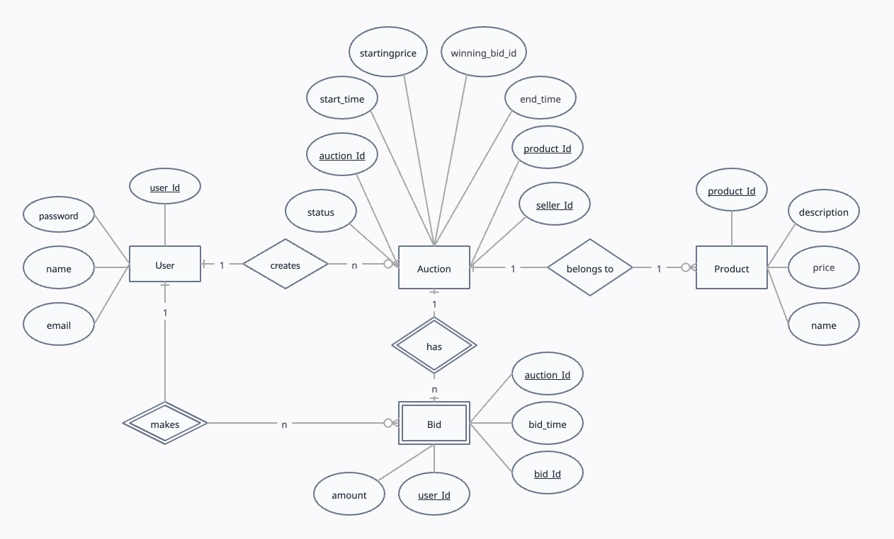


Das ERM der Anwendung umfasst vier zentrale Entitäten:

- **Users**
  - **Attribute:** ID, Name, E-Mail, Passwort *(in der Demo unverschlüsselt, in einer echten Umgebung gehashed)*
  - **Beziehungen:**
    - Ein Benutzer kann mehrere Auktionen als Verkäufer erstellen.
    - Ein Benutzer kann mehrere Gebote abgeben.

- **Auction**
  - **Attribute:** ID, Startzeit, Endzeit, Startpreis, Status (RUNNING, CLOSED), product_id (FK), seller_id (FK), winning_bid_id
  - **Beziehungen:**
    - Jede Auktion gehört zu einem Produkt.
    - Jede Auktion ist einem Verkäufer (User) zugeordnet.
    - Eine Auktion kann mehrere Gebote enthalten.

- **Products**
  - **Attribute:** ID, Name, Beschreibung, Preis
  - **Beziehungen:**
    - Ein Produkt wird in einer Auktion angeboten.
    - Ein Produkt gehört zu genau einem User, wird hier zu Demonstrationszwecken direkt mit der Auktion erstellt.

- **Bids**
  - **Attribute:** ID, Amount, bid_time, auction_id (FK), user_id (FK)
  - **Beziehungen:**
    - Ein Gebot gehört zu einer spezifischen Auktion.
    - Ein Gebot wird von einem User abgegeben.

## Installation & Konfiguration

1. Repository klonen  
   git clone <https://github.com/WWIBE23/portfolio-wwibe123-ebay.git>
   cd ebaycomponent

2. Abhängigkeiten installieren  
   ./mvnw clean install  
   (macOS/Linux)  
   oder  
   mvnw.cmd clean install  
   (Windows)

3. application.properties anpassen  
   In src/main/resources/application.properties trägst du deine Datenbank-Verbindungsdaten ein:

   spring.datasource.url=jdbc:postgresql://localhost:5432/ebay_component
   spring.datasource.username=ebaycomponent_user
   spring.datasource.password=12345
   spring.jpa.hibernate.ddl-auto=update
   spring.jpa.properties.hibernate.dialect=org.hibernate.dialect.PostgreSQLDialect

4. Anwendung starten  
   ./mvnw spring-boot:run  
   oder  
   mvnw.cmd spring-boot:run  
   Nach erfolgreichem Start läuft der Server auf http://localhost:8080.

--------------------------------------------------

## Datenbank

- PostgreSQL  
  Stelle sicher, dass PostgreSQL installiert ist und ein Datenbank-Cluster läuft.

- Tabellen  
  Beim ersten Start legt Spring Boot automatisch Tabellen wie "users", "auctions", "bids" und "products" an 
  (abhängig von der Einstellung ddl-auto=update).

- ORM  
  Spring Data JPA übernimmt das Mapping zwischen deinen Entities (z.B. User, Auction) und den Datenbanktabellen.

  **Hinweis:**

  Aus Kostengründen wird hier eine lokale PostgreSQL-Datenbank verwendet. In einem produktiven System würde stattdessen eine Cloud-Datenbank wie AWS RDS, Google Cloud SQL genutzt werden.

--------------------------------------------------

## API-Endpunkte

### Registrierung

- **GET /users/register**  
  Zeigt das Registrierungsformular (`userform.html`) an.  
  *Hinweis:* Dieses Formular ermöglicht es einem neuen Benutzer, seine Daten einzugeben.

- **POST /users/register**  
  Verarbeitet die vom Formular übermittelten Benutzerdaten.  
  Erfolgreich registrierte Benutzer werden zur Erfolgsseite weitergeleitet (`/success`).

- **GET /users/{id}**

  Gibt Informationen zu einem bestimmten Benutzer zurück.
  Beispiel Response:

  ```json
  {
      "name": "Gregory Peck",
      "email": "Gregorypeck@example.com"
  }

---

### Auction

- **GET /auctions/{id}**  
  Ruft eine Auktion anhand ihrer ID ab und liefert das Ergebnis als JSON zurück. (Zu Testzwecken bspw. mit Postman)

  Beispiel Response:

  ```json
  {
      "id": 1,
      "startTime": "2025-03-01T10:00:00",
      "endTime": "2025-04-01T10:00:00",
      "startingPrice": 100.0,
      "status": "RUNNING",
      "product": {
          "id": 10,
          "name": "Iphone 16 Pro",
          "price": 1400.0
      },
      "seller": {
          "id": 2,
          "name": "Seller Name",
          "email": "seller@example.com"
      },
      "bids": []
  }

- **GET /auctions/create-auction**
  Zeigt das Formular zur Erstellung einer neuen Auktion an – die View (`createauction.html`) wird geladen.

- **POST /auctions/create-auction**
  Verarbeitet die im Formular eingegebenen Auktionsdaten und erstellt eine neue Auktion.
  Erfolgreich erstellte Auktionen werden zur Detailseite weitergeleitet, z. B.
  redirect:/auctions/product/{productId}.


- **GET /auctions/product/{productId}**
  Zeigt die Auktionsdetails für das Produkt mit der angegebenen ID an.
  Die View (`auctiondetails.html`) wird geladen und enthält zusätzlich ein Formular zum Abgeben eines Gebots.

- **POST /auctions/product/{productId}/bid**
  Verarbeitet ein neues Gebot für die Auktion, die dem übergebenen Produkt zugeordnet ist. Dies findet somit direkt in der Auctiondetails View statt. Die Überprüfung, von welchem User das Gebot abgegeben werden soll findet über die E-Mail Abfrage statt. Hierdurch wurde sichergestellt, dass man nicht auf seine eigenen Auktionen Gebote abgeben kann.

  *Hinweis:* Obwohl diese Methode üblicherweise via HTML-Formular aufgerufen wird, kann man als Beispiel folgenden JSON-Body verwenden, wenn sie auch als API genutzt würde:

  ```json
  {
    "bidder": {
        "email": "Gregorypeck@example.com"
    },
    "bidAmount": 150.0
  }

---

### Fehlerbehandlung

Wird in der Anwendung eine Exception ausgelöst, sorgt ein zentraler Exception-Handler dafür, dass der Fehler konsistent behandelt wird:

- **Globale Erfassung:**  
  Eine zentrale Fehlerbehandlung fängt sowohl Laufzeitfehler als auch allgemeine Exceptions ab.

- **Fehlermeldung im Model:**  
  Die Exceptions liefern ihre Fehlermeldung, die im Model gespeichert wird.

- **Weiterleitung an `/error`:**  
  Anschließend wird der Request an den `/error`-Endpunkt weitergeleitet, der die Fehlerseite (`error.html`) anzeigt.  
  So bekommt der Benutzer eine informative Fehleranzeige, in der der Fehlercode und die Fehlermeldung zu sehen sind.

---

### Produkt

- **POST /products/create-product**  
  Erstellt ein neues Produkt (ohne GUI-Anbindung).  
  Beispiel Request Body:
  ```json
  {
      "name": "Iphone 16 Pro",
      "description": "High-end Smartphone",
      "price": 1400.0
  }

--------------------------------------------------

## Entwicklung & Tests

- IDE: Visual Studio Code (Java Extension Pack und Spring Boot Tools installiert)
- Debugging:  
  - Starte den VS Code-Debugger  
  - Setze Breakpoints in Controllern und Services

- Unit-Tests:  
   ./mvnw test  
   (Die Unit-Tests überprüfen Kernfunktionen, z.B. Auktionserstellung und Gebotsvalidierung.)

--------------------------------------------------

## Deployment

- **Produktionsdatenbank:**  
  Die Verbindung zur PostgreSQL-Datenbank wird in der application.properties konfiguriert:

  ```properties
  spring.datasource.url=jdbc:postgresql://localhost:5432/ebay_component
  spring.datasource.username=ebaycomponent_user
  spring.datasource.password=12345
  ```
  **Achtung!**: In einer Produktivumgebung sollten diese Werte über sichere Mechanismen z.B. über Umgebungsvariablen oder durch einen Secrets Manager bereitgestellt werden.

- Jar erstellen:  
   ./mvnw clean package  
   Nach erfolgreichem Build findest du das ausführbare Jar im target/ Ordner.

- Anwendung starten:  
   java -jar target/ebay-clone-1.0.0.jar

  **CI/CD-Pipeline:**  
  Automatisierte Deployments könnten mit **GitHub Actions** oder **Jenkins**  
  realisiert werden, um den Build-, Test- und Deployment-Prozess effizienter zu gestalten und stabiler zu machen.

--------------------------------------------------

## Anwendungsablauf

Die Anwendung ermöglicht derzeit folgende Schritte, welche folgend mit Screenshots auch dokumentiert wurden:

1. **Registrierung:**  
   Der Benutzer beginnt auf der Registrierungsseite (`/users/register`), wo er seine Daten im Formular eingibt.  


   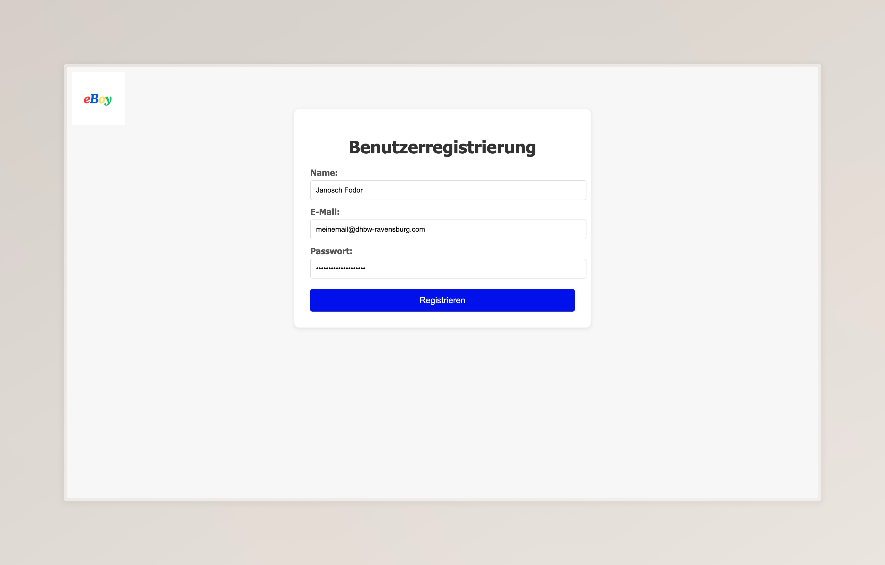

  
   Nachdem die Registrierung erfolgreich abgeschlossen wurde, erhält man in der nächsten Page eine Erfolgsmeldung (`/success`), diese dauert 5 Sekunden an, bis man zur Seite der Auktion Erstellung weitergeleitet wird:


   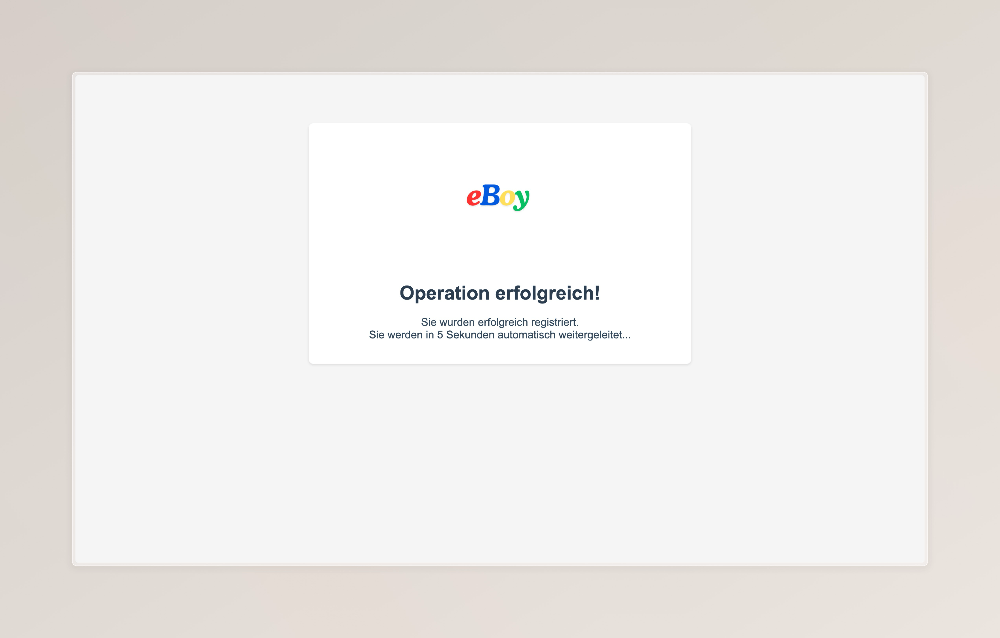

2. **Auktion erstellen:**  
   Nach einer erfolgreichen Registrierung wird der Benutzer zur Seite zur Erstellung einer Auktion (`/auctions/create-auction`) weitergeleitet.  
   Hier kann er alle relevanten Auktionsdaten eingeben.  


   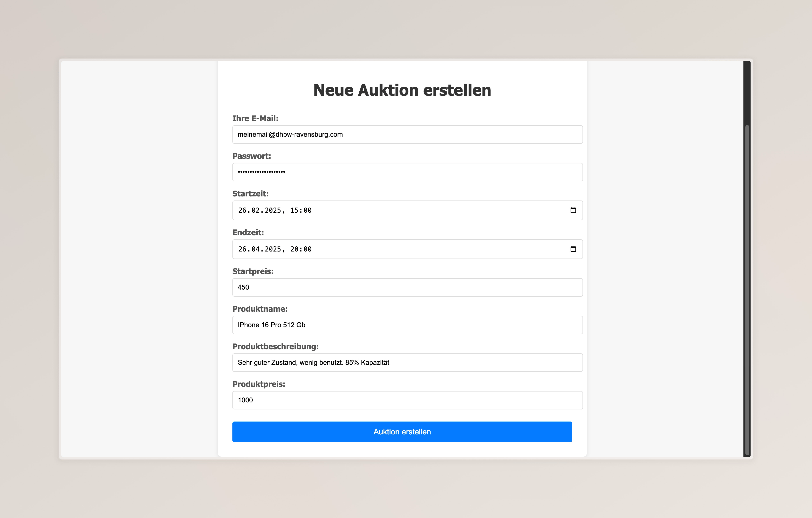

3. **Auktionsdetails:**  
   Sobald die Auktion erstellt wurde, erfolgt eine Weiterleitung zur Auktionsdetailseite (`/auctions/product/{productId}`).  
   Dort kann der Benutzer die erstellte Auktion samt aktueller Gebote einsehen.  

     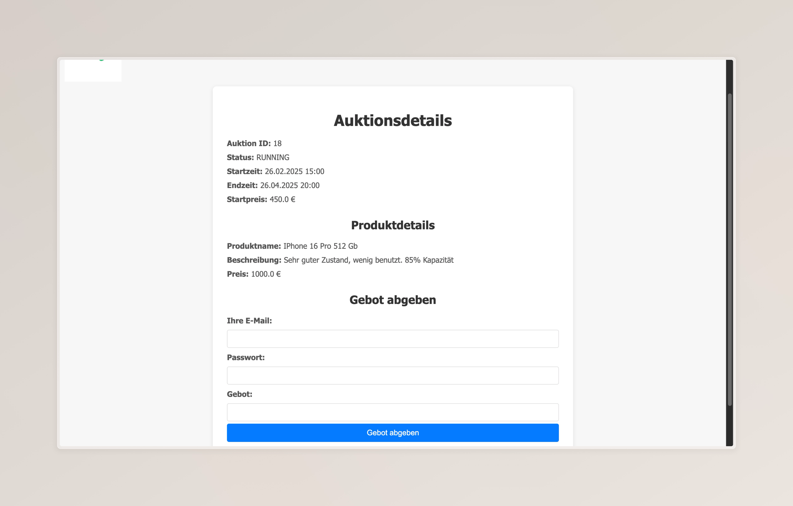
   
4. **Gebot abgeben:**  
   Da die Auktionsdetailseite (`/auctions/product/{productId}/bid`) zukünftig auch beim klicken auf ein Produkt des Produktkatalogs zugleich die Bieterfunktion anbieten soll, wurde diese Funktion bereits in der Auktiondetailseite implementiert. 
   Zu Demnonstrationszwecken können nun auf dieser Seite alle anderen Nutzer, die in der PostgreSql Datenbank eingetragen sind, ein Gebot abgeben, nachdem diese ihre Mail-Adresse und Passwort zur Validierung mitgegeben haben: 

    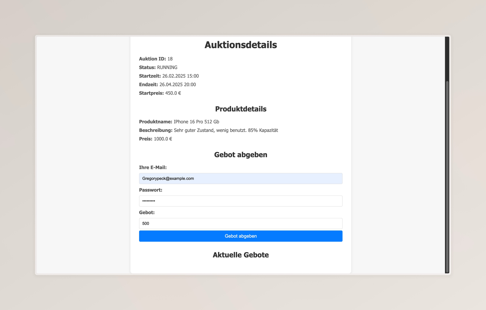

   *Hinweis*: In einer produktiven Umgebung sollten Passwörter niemals im Klartext gespeichert oder verglichen werden. Üblicherweise verwendet man hierfür Hashing-Mechanismen. Dieses Beispiel dient lediglich der Veranschaulichung ohne zusätzliche Sicherheitsfunktionen.

   Anzeige der aktiven Gebote:
   
   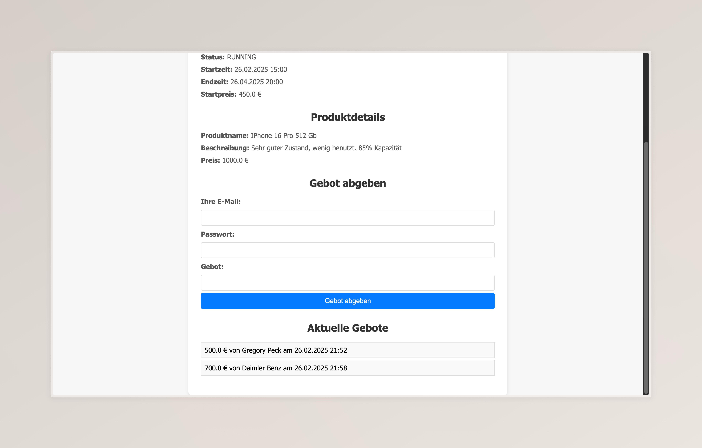


5. **Gewinner ermitteln:**
   Mithilfe eines Auction-Schedulers, werden alle 2 Minuten alle Auktionen hinsichtlich des Endzeitpunkts überprüft. Sobald `LocalDateTime` > `end_time` der Auktion ist, wird der Status auf `CLOSED`gesetzt. Das Feld mit der Gebotabgabe wird ausgeblendet und der Gewinner wird auf der Auktionsdetailsseite angezeigt:


   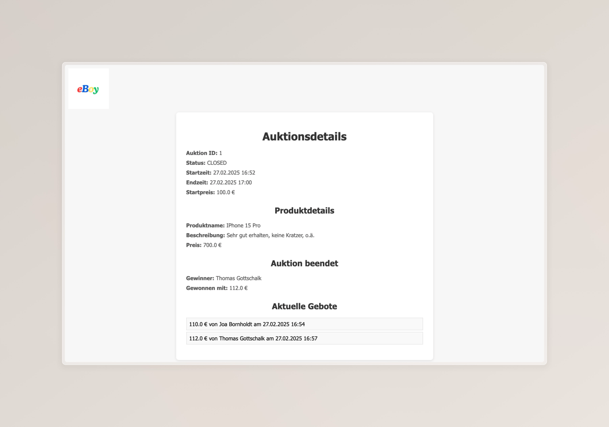


   *Hinweis:* Wenn kein Gebot abgegeben wird, während die Auktion läuft, wird nach der Auktion in dieser Anzeige dementsprechend darauf hingewiesen.

#### Fehlermeldungen

   Beispiel einer Fehlermeldung, falls ein User versucht vor dem Startdatum der Auktion ein Gebot abzugeben:

   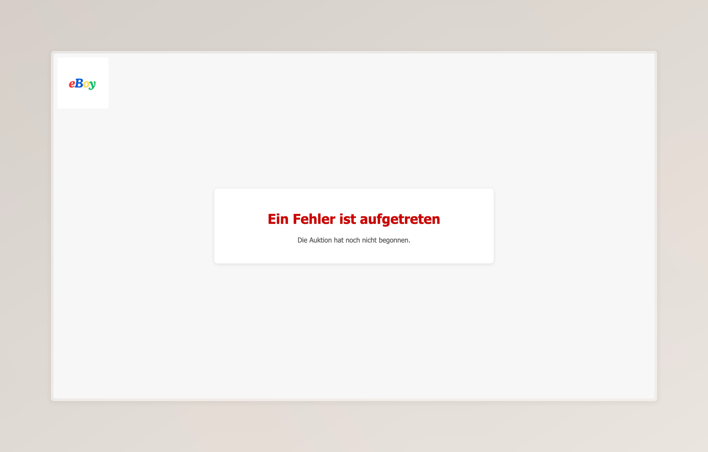


   Beispiel einer Fehlermeldung, falls der Seller auf seine eigene Auktion zu bieten:


   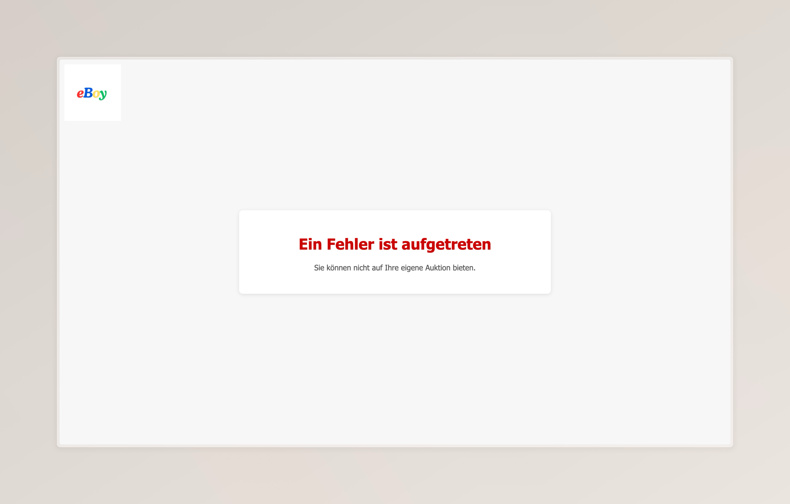

  
   Beispiel einer Fehlermeldung, falls das neue Gebot nicht dem aktuellen Höchsgebot entspricht:


   


   ### Queries zum Anwendungsbeispiel


1. Query zur Auktion: 

   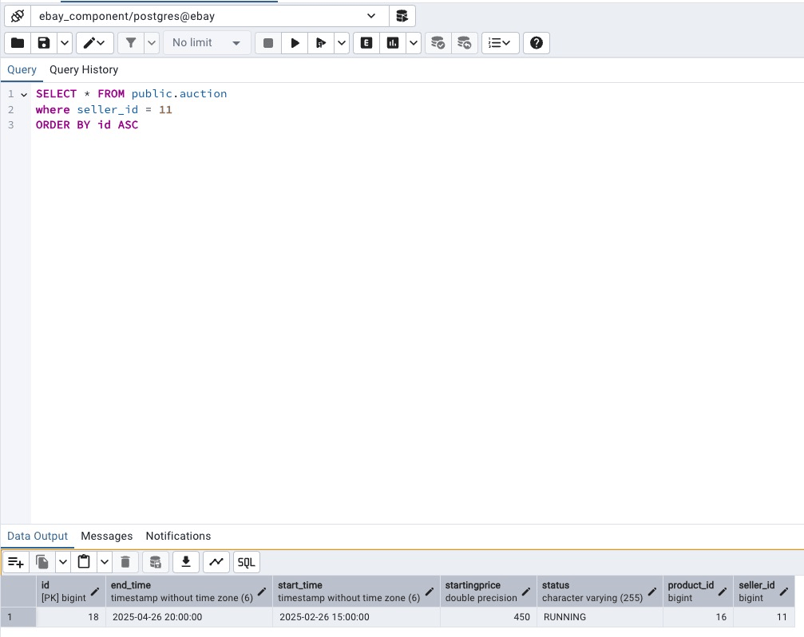

2. Query zu den beteiligten Usern:

   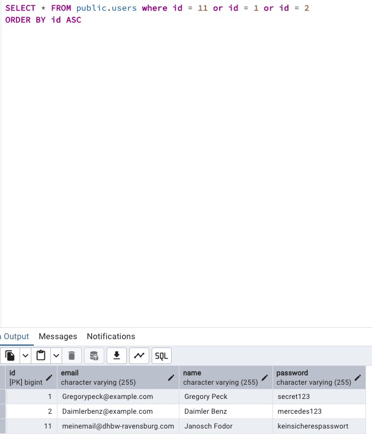

3. Query zum Produkt: 

   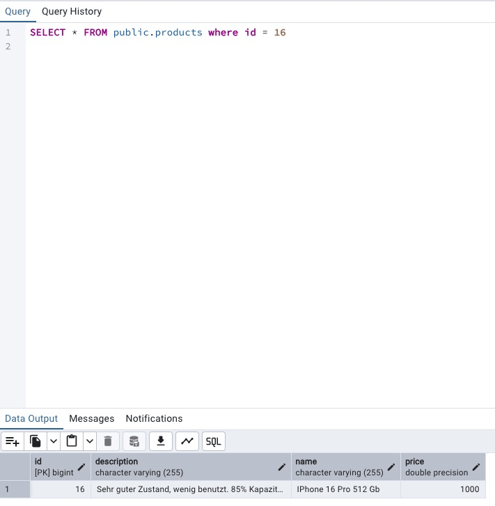

4. Query zu den Geboten:

   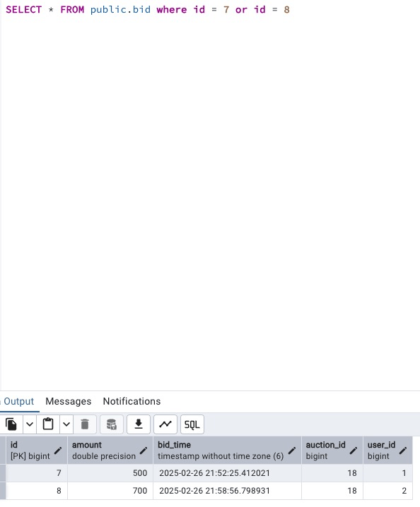


--------------------------------------------------

## Ausblick

In der aktuellen Version handelt es sich um einen funktionalen Prototypen. Für eine produktive Umgebung gibt es jedoch einige wichtige Punkte zu beachten:

### Sicherheit

- **API-Absicherung:**  
  In einer echten Produktivumgebung wäre es essenziell, die API mit OAuth2 abzusichern, um nur autorisierten Nutzern den Zugriff zu erlauben.  
  Für diesen Prototypen wurde bewusst darauf verzichtet, um den Fokus auf die Kernfunktionalität zu legen.

- **Datenverschlüsselung:**  
  Alle Datenübertragungen sollten in einer Live-Umgebung ausschließlich über HTTPS erfolgen, um sensible Informationen zu schützen.

- **Sicherer Umgang mit Zugangsdaten:**  
  Im aktuellen Prototyp sind Datenbankzugänge und Passwörter zu Demonstrationszwecken direkt im Code hinterlegt,  
  In einem echten System sollten solche sensiblen Daten sicher verwaltet werden, z.B. mit einem Secrets Manager oder mithilfe von Umgebungsvariablen.

- **Schutz vor Missbrauch:**  
  Um Missbrauch wie Brute-Force-Angriffe zu vermeiden, könnte eine Rate Limiting Funktion implementiert werden, die zu viele Anfragen in kurzer Zeit blockiert.  

---

### Skalierung & Performance

- **Verteilung der Last:**  
  In einem produktiven System könnte ein Load Balancer den eingehenden Traffic automatisch auf mehrere Server verteilen. So bleibt die Anwendung auch bei hoher Nutzeranzahl performant.

- **Optimierung der Datenbankzugriffe:**  
  Häufig abgerufene Daten wie z. B. die aktuellen Höchstgebote einer Auktion könnten zwischengespeichert werden, um die Datenbank zu entlasten. Ein Cache sorgt dafür, dass Nutzer Daten schneller erhalten.

---

### Echtzeit-Funktionen

- **Live-Updates bei Geboten:**  
  Damit Nutzer immer den aktuellen Stand der Auktionen sehen, könnten WebSockets eingesetzt werden. So erhalten alle Bieter in Echtzeit Updates, wenn ein neues Gebot abgegeben wird, ohne, dass sie die Seite
  aktualisieren müssen.

- **Microservice-Architektur:**  
  Da dieser Prototyp bereits als eigenständiger Microservice konzipiert ist,könnte er problemlos in eine größere Systemlandschaft integriert werden. In einer produktiven Umgebung würde der Service mithilfe eines API-Gateways (siehe ACD) eingebunden werden.
  
--------------------------------------------------

## Credits

  Made by Janosch Fodor.

--------------------------------------------------

Feedback:
Falls du Vorschläge zur Verbesserung hast oder Fehler findest, erstelle bitte ein Issue oder einen Pull Request :)

